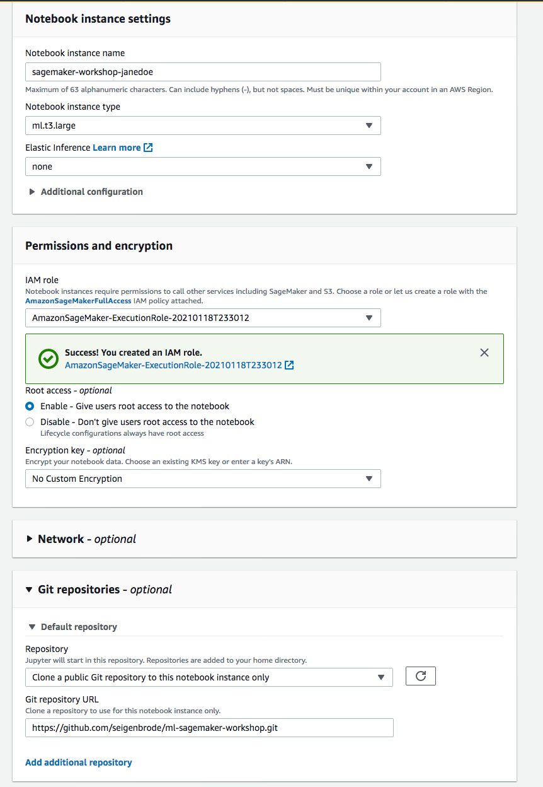
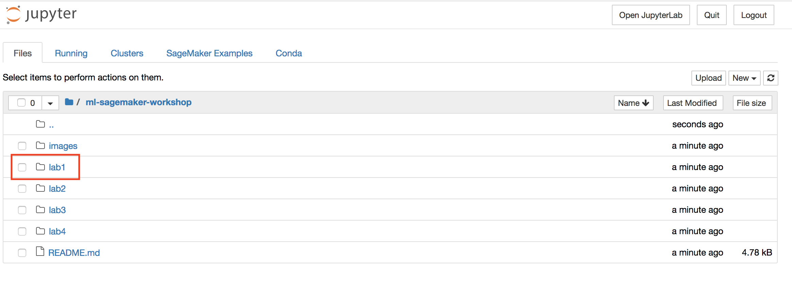

# SageMaker Workshop

  **Description:** This workshop was created to walk users through the end-to-end process and considerations for utilizing SageMaker for Machine Learning.   
  
 The workshop is broken into 4 Labs with an additional step for lab setup: 
 
   * **Lab Setup**
   * **Lab 1:** Data Exploration & Feature Engineering
   * **Lab 2:** Data Processing at Scale using SageMaker Processing
   * **Lab 3:** Build, Train, and Deploy using SageMaker Built-In-Algorithm
   * **Lab 4:** Build, Train, and Deploy using SageMaker Bring-Your-Own-Algorithm
    
 ---
 
 ## **Lab Setup**
    
   ### Login to your AWS Account 
   
   1) Click on the Event Engine URL that is provided by your moderators     
   2) Click on **AWS Console** followed by **Open AWS Console** to login to your lab account
   3) Once logged in, ensure that you are on the US East (N.Virginia) us-east-1 region. You can verify this by checking the upper right hand corner showing the regions.
   
   ### Create SageMaker Notebook Instance 
   
   1) Go to [Amazon SageMaker Service](https://console.aws.amazon.com/sagemaker/)
   2) Ensure you are in *us-east-1/N.Virginia*
   3) Select **Notebook instances** from the left menu
   4) Select **Create notebook instance** in the upper right corner
   5) Under *Notebook Instance Settings*, complete/update the following:
       * **Notebook instance name:** Enter a name for the notebook instance (Ex: sagemaker-workshop-janedoe)
       * **Notebook instance type:** ml.t3.large
       * Toggle **Additional configuration**, enter 15 for **Volume Size in GB**
   6) Under *Permissions and encryption*, complete/update the following:
       * **IAM Role:** Create a new role --> Select 'any S3 bucket' --> Create Role
   7) Under *Git Repositories*:
       * select 'Clone a public git repository to this notebook instance only' from the dropdown
       * Enter 'https://github.com/seigenbrode/ml-sagemaker-workshop.git' under *Git Repository URL*
       
   8) Leave all other sections using default settings, then click **Create notebook instance**
   9) It will take a few moments for the **Status** to change to **InService**
   10) Once the notebook is showing **InService**, click the **Open Jupyter** link to open your hosted notebook instance
   
 ---
 
 For today's labs we will be working inside Jupyter Notebooks.  If you are unfamiliar with Jupyter, below are a few quickstart resources you can review or reach out to your moderator for assistance: 
 
   * [Jupyter Notebook Cheatsheet](https://www.edureka.co/blog/cheatsheets/jupyter-notebook-cheat-sheet)
    
   * [Basics of Jupyter Notebooks](https://towardsdatascience.com/a-beginners-tutorial-to-jupyter-notebooks-1b2f8705888a)
 
 ## Lab 1: Data Exploration & Feature Engineering  
   
 From within the notebook instance we created in Lab Setup above:
 
   1) Go to the **Files** tab
   2) Click **ml-sagemaker-workshop/lab1**
   3) Click **xgboost_direct_marketing_sagemaker.ipynb** to open Lab 1
   4) The remaining steps for this lab are performed within the notebook instance
   
   
---
 
 ## Lab 2: Data Processing at Scale using SageMaker Processing
   
 This is a two part lab to showcase using Amazon SageMaker Processing in two different scenarios.
 
 For Part 1:  We will utilize SageMaker Processing for data pre-processing using the SKLearnProcessor as well as for model evalution after training our model.  
 
   1) Go to the **Files** tab
   2) Click **ml-sagemaker-workshop/lab2**
   3) Click **Part1-SageMakerProcessing.ipynb** to open Part 1 of Lab 2
   4) The remaining steps for this lab are performed within the notebook instance

For Part 2: We will also create our own custom processor using ScriptProcessor to demonstrate the ability to bring your own container as well

   1) Go to the **Files** tab
   2) Click **ml-sagemaker-workshop/lab2**
   3) Click **Part2-SageMakerProcessing-DASK.ipynb** to open Part 2 of Lab 2
   4) The remaining steps for this lab are performed within the notebook instance
   
---
 
 ## Lab 3: Build, Train, and Deploy using SageMaker Built-In-Algorithm
   
 From within the notebook instance we created in Lab Setup above:
 
   1) Go to the **Files** tab
   2) Click **ml-sagemaker-workshop/lab3**
   3) Click **xgboost_customer_churn.ipynb** to open Lab 3
   4) The remaining steps for this lab are performed within the notebook instance

---
 
 ## Lab 4: Build, Train, and Deploy using SageMaker Built-In-Algorithm
   
 From within the notebook instance we created in Lab Setup above:
 
   1) Go to the **Files** tab
   2) Click **ml-sagemaker-workshop/lab4**
   3) Click **Lab4-btd-bring-your-own-algorithm.ipynb** to open Lab 4
   4) The remaining steps for this lab are performed within the notebook instance  
